# Client to Enclave Request Flow

```mermaid
sequenceDiagram
    participant CRE as CRE Node
    participant Act as baseConfidentialAction
    participant Ex as RealExecutor
    participant Pool as enclavePool
    participant Sel as roundRobinEnclaveSelector
    participant VD as VaultDON
    participant Enc as enclaveServer
    participant AV as AttestationValidator
    participant KS as Keystore

    Note over Ex,Pool: background lifecycle before and between requests
    Note over Pool: NewPoolWithConfig runs initialWarmup when EnableCache and EnableProactiveRefresh are set
    loop pool refreshCacheLoop at RefreshIntervalPercent of DefaultTTL
        Pool->>Enc: refreshSingleKey GET publicKeys within RefreshTimeout
        Enc-->>Pool: attested PublicKeyResponse
        Pool->>Sel: SetEnclaveLiveness true on success and false on failure
    end
    loop executor startEnclaveRefreshLoop every EnclaveRefreshInterval default 10s
        Ex->>Pool: EnsureFreshEnclaves calls UpdateNodes with enclaves from the capability config
        Pool->>Enc: validateNodes GET publicKeys for each new node
        Enc-->>Pool: attested PublicKeyResponse
        Pool->>AV: validateAttestation over PublicKeyHash
        alt a node fails to fetch or validate
            Note over Pool: old nodes and measurements are kept and attestation_validation_fallback_used is emitted
        else all nodes validate
            Pool->>Pool: nodes are replaced and publicKeyCache is flushed
        end
        opt DON membership changed
            Ex->>Pool: GetConfigs
            Pool-->>Ex: EnclaveConfig with Signers T and F
            Ex->>KS: sign the config hash with StandardCapabilityAccount
            Ex->>Pool: UpdateConfig with the signed vote
            Pool->>Enc: PATCH SetConfigPath to every enclave
            Enc-->>Pool: 202 Accepted until F plus 1 signer votes are collected
        end
    end
    CRE->>Act: Execute with metadata and input
    Act->>Act: deterministic proto Marshal of the input
    Act->>Ex: Execute protoBytes secrets metadata
    Ex->>Ex: initLazily once then refreshLimitSettings on every run
    Ex->>Ex: rateLimiter Allow for the WorkflowOwner
    alt rate limit exceeded
        Ex-->>Act: rate limit exceeded error
        Act-->>CRE: error
    end
    Ex->>Ex: reqID is sha256 of the WorkflowExecutionID
    loop retryWithBackoff up to MaxRetries default 3 with backoff default 2s doubling
        Ex->>Ex: EnsureFreshEnclaves refreshes pool nodes and DON membership
        Ex->>Pool: GetPublicKeys with reqID
        Pool->>Sel: SelectEnclaves over the pool nodes
        Note right of Sel: index is bigInt of reqID mod node count so all DON nodes converge on the same enclave
        alt no live enclave
            Sel-->>Pool: no live enclaves available
            Pool-->>Ex: error returned to retryWithBackoff
        else one enclave selected
            Sel-->>Pool: the selected enclave
        end
        Pool->>Enc: GET PublicKeyPath with requestID auth header and RoutingHeader
        Note over Pool: each attempt is bounded by PublicKeyRequestTimeout with the DefaultPublicKeyRequestTimeout fallback
        Note over Pool: transport errors retry up to PublicKeyRetriesMax with PublicKeyRetriesBackoff
        Enc->>Enc: keychain maps requestID to one keypair and attestPublicKeys issues an NSM attestation over PublicKeyHash
        Enc-->>Pool: PublicKeyResponse with PublicKeys TTLs Config and Attestation
        Pool->>AV: validateAttestation over PublicKeyHash
        Note right of AV: ForEnclaveType picks the Nitro or fake validator and tries each TrustedValues measurement
        alt fetch or measurement validation fails with no cached key
            AV-->>Pool: validation error
            Pool-->>Ex: error returned to retryWithBackoff
        else fetch or measurement validation fails but a cached key exists
            Pool->>Pool: fall back to the cached EnclavePublicKeyData
            Pool-->>Ex: cached EnclavePublicKeyData
        else a TrustedValues measurement validates
            AV-->>Pool: attestation is valid
            Pool->>Pool: key cached with min TTL minus buffer capped at MaxTTL
            Pool-->>Ex: EnclavePublicKeyData
        end
        Ex->>Ex: validateEnclaveSigners checks Signers equal DON members and enclave F
        Ex->>Ex: choose the most recent ephemeral public key by CreationTimes
        alt no secrets requested
            Ex->>Ex: VaultDON call is skipped
        else secrets requested
            alt every secret is cached
                Ex->>Ex: serve cached encryptedSecrets and encryptedDecryptionShares
            else cache miss
                Ex->>VD: Execute GetSecrets with EncryptionKeys set to the enclave ephemeral public key
                Note over VD,Enc: VaultDON encrypts each secret under the enclave ephemeral public key
                Note over Enc: only the enclave holds the matching ephemeral private key
                VD-->>Ex: encryptedSecrets and encryptedDecryptionShares
                Ex->>Ex: check at least CryptographyThreshold 2F plus 1 shares per secret
            end
        end
        Ex->>KS: SignComputeRequest
        Note over Ex,KS: the Keystore signs the domain separated request hash with the StandardCapabilityAccount key
        KS-->>Ex: SignedComputeRequest
        Note over Pool,AV: enclave public keys are attestation validated before the compute request is sent
        Ex->>Pool: ExecuteBatch with one SignedComputeRequest and one enclaveID
        Note over Ex,Pool: the executor waits for exactly one enclave response per request
        Pool->>Pool: resolve EnclaveRequestTimeout from cresettings or DefaultEnclaveRequestTimeout
        Pool->>Pool: wrap the call context WithTimeout
        Pool->>Enc: POST ExecutePath with auth header RoutingHeader and session header
        Note over Enc: handleExecute verifies the signature and recovers plaintext secrets from the threshold shares
        Note over Enc: the enclave app executes and the response carries an Attestation
        Enc-->>Pool: ExecuteResponse with Output Attestation RequestHash and ApplicationRequestID
        Pool->>AV: validateAttestation over UserDataHash of the response
        Pool->>Pool: verify RequestHash and ApplicationRequestID match the request
        alt non OK status or body over MaxEnclaveResponseBodyBytes or attestation or hash mismatch
            Pool-->>Ex: error returned to retryWithBackoff
            opt error contains ErrQuorumTimeout
                Ex->>Ex: quorum_timeout metric is emitted and the attempt is retried
            end
            opt error is a public user error class
                Ex->>Ex: ErrEncryptionRequestedNoKey ErrKeyPresentNoEncryption ErrResponseBodyTooLarge and ErrWasmExecutionTimeout skip the remaining retries
            end
        else response is valid
            Pool-->>Ex: ExecuteResponse
            Ex->>Ex: validateEnclaveSigners on the response Config
            Ex->>Ex: forward MetricEvents and Metrics as observability events
        end
    end
    alt retries exhausted with ErrQuorumTimeout and quorumTimeoutIsUserError
        Ex-->>Act: public user error with DeadlineExceeded
    else public user error short circuited the retries
        Ex-->>Act: public user error returned without retrying
    else retries exhausted with a system error
        Ex-->>Act: failed after MaxRetries error
    else an attempt succeeded
        Ex-->>Act: Output bytes
        Act->>Act: proto Unmarshal into TOutput
        Act-->>CRE: ResponseAndMetadata
    end
```

<!-- diagram:BEGIN id=client-to-enclave-flow digest=21e0105e81444a7e -->
<!-- Generated from the sources listed in .github/diagrams.yaml. Do not edit by hand; edit the manifest instructions instead. -->

<!-- diagram:END id=client-to-enclave-flow -->

## Sources

Generated from [`capabilities/framework/executor.go`](../../capabilities/framework/executor.go), [`capabilities/framework/executor_request_timeout.go`](../../capabilities/framework/executor_request_timeout.go), [`capabilities/framework/base_action.go`](../../capabilities/framework/base_action.go), [`capabilities/framework/types.go`](../../capabilities/framework/types.go), [`enclave-client/pool.go`](../../enclave-client/pool.go), [`enclave-client/client.go`](../../enclave-client/client.go), [`enclave-client/enclave-selector/round_robin_enclave_selector.go`](../../enclave-client/enclave-selector/round_robin_enclave_selector.go), [`enclave-client/enclave-selector/selector.go`](../../enclave-client/enclave-selector/selector.go), [`enclave-client/attestation-validator/validator.go`](../../enclave-client/attestation-validator/validator.go), [`enclave/server/server.go`](../../enclave/server/server.go).
