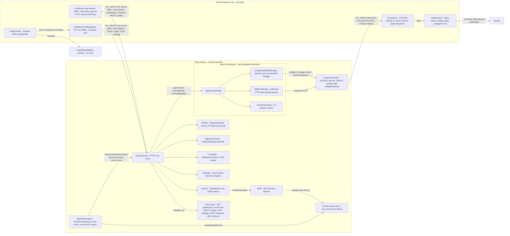

# Enclave Architecture

<!-- diagram:BEGIN id=enclave-architecture digest=f0b1dc7ca2c3d9cd -->
<!-- Generated from the sources listed in .github/diagrams.yaml. Do not edit by hand; edit the manifest instructions instead. -->

<!-- diagram:END id=enclave-architecture -->

## Sources

Generated from [`enclave/nitro/starter.go`](../../enclave/nitro/starter.go), [`enclave/nitro/types.go`](../../enclave/nitro/types.go), [`enclave/nitro/entropy.go`](../../enclave/nitro/entropy.go), [`enclave/server/server.go`](../../enclave/server/server.go), [`enclave/server/memory.go`](../../enclave/server/memory.go), [`enclave/server/response_emitter.go`](../../enclave/server/response_emitter.go), [`enclave/nitro/host/host.go`](../../enclave/nitro/host/host.go), [`enclave/nitro/host/public_data.go`](../../enclave/nitro/host/public_data.go), [`enclave/nitro/host/proxy-server/server.go`](../../enclave/nitro/host/proxy-server/server.go), [`enclave/nitro/host/proxy-server/policy.go`](../../enclave/nitro/host/proxy-server/policy.go), [`enclave/nitro/proxy-client/client.go`](../../enclave/nitro/proxy-client/client.go), [`enclave/nitro/proxy-client/policy.go`](../../enclave/nitro/proxy-client/policy.go), [`enclave/services/attestor/attestor.go`](../../enclave/services/attestor/attestor.go), [`enclave/services/attestor/nitro_attestor.go`](../../enclave/services/attestor/nitro_attestor.go), [`enclave/services/combiner/combiner.go`](../../enclave/services/combiner/combiner.go), [`enclave/services/combiner/tdh2easycombiner.go`](../../enclave/services/combiner/tdh2easycombiner.go), [`enclave/services/emitter/noopemitter.go`](../../enclave/services/emitter/noopemitter.go), [`enclave/services/keychain/box_keychain.go`](../../enclave/services/keychain/box_keychain.go), [`enclave/services/keychain/keychain.go`](../../enclave/services/keychain/keychain.go), [`enclave/services/signature-verifier/ed25519_signature_verifier.go`](../../enclave/services/signature-verifier/ed25519_signature_verifier.go), [`enclave/services/signature-verifier/verifier.go`](../../enclave/services/signature-verifier/verifier.go), [`enclave/config-tracker/config_tracker.go`](../../enclave/config-tracker/config_tracker.go), [`enclave/config-tracker/main.go`](../../enclave/config-tracker/main.go), [`enclave/apps/confidential-echo/app/app.go`](../../enclave/apps/confidential-echo/app/app.go), [`enclave/apps/confidential-http/app/app.go`](../../enclave/apps/confidential-http/app/app.go), [`enclave/apps/confidential-workflows/app/app.go`](../../enclave/apps/confidential-workflows/app/app.go).
